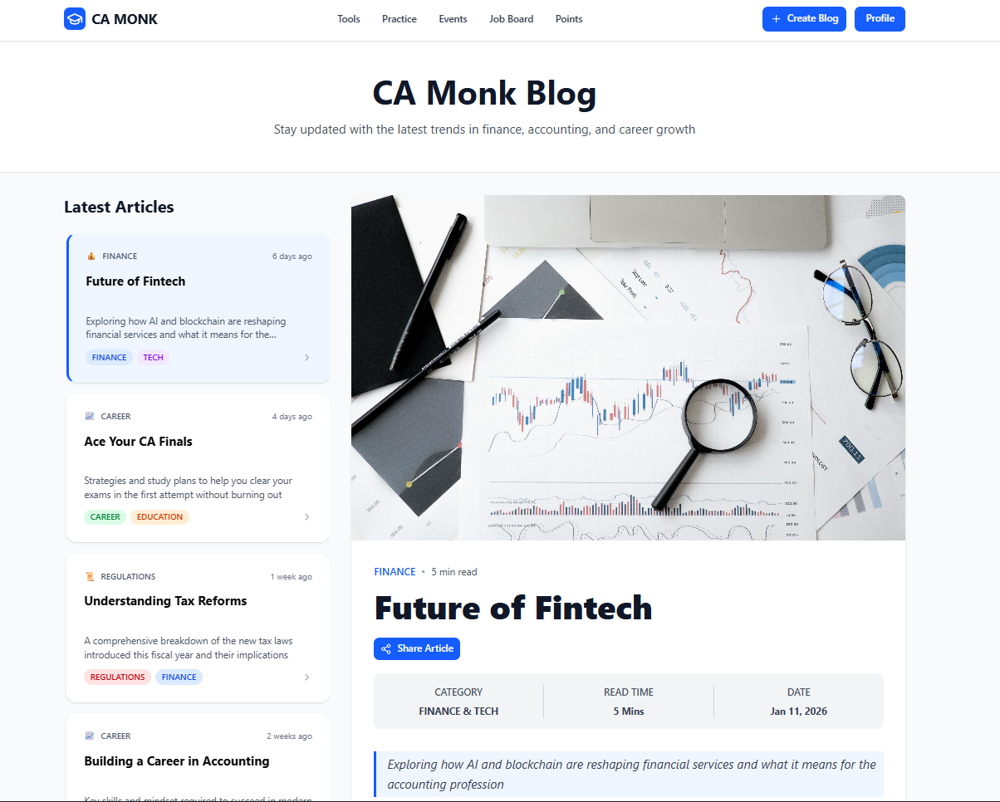

# CA Monk - Blog Application

A modern, responsive blog application built with React, TypeScript, TanStack Query, Tailwind CSS, and shadcn/ui. This project demonstrates advanced state management, clean architecture, and professional UI/UX design principles.



## 🚀 Features Implemented

### Core Functionality
- ✅ **Blog Listing** - Display all blogs with real-time data fetching using TanStack Query
- ✅ **Blog Details** - Individual blog view with cover images, content, and metadata
- ✅ **Create Blog** - Modal form to create new blogs with category selection and validation
- ✅ **Blog Selection** - Interactive blog cards with selection highlighting

### UI/UX Features
- ✅ **Responsive Design** - Fully responsive layout for mobile, tablet, and desktop
- ✅ **Sticky Navigation** - Fixed navbar and hero section for better navigation
- ✅ **Scrollable Panels** - Independent scrolling for blog list and content areas
- ✅ **Hidden Scrollbars** - Clean UI with custom scrollbar styling
- ✅ **Loading States** - Skeleton loaders for better user experience
- ✅ **Error Handling** - Graceful error messages and fallback UI
- ✅ **Category Badges** - Color-coded category tags for easy identification
- ✅ **Relative Timestamps** - Human-readable dates (e.g., "2 days ago")

### Technical Implementation
- ✅ **TanStack Query** - Efficient server state management with caching and invalidation
- ✅ **TypeScript** - Full type safety across the application
- ✅ **Tailwind CSS** - Utility-first styling with custom configurations
- ✅ **shadcn/ui** - Beautiful, accessible UI components
- ✅ **Component Architecture** - Well-organized, reusable components
- ✅ **Custom Hooks** - Clean separation of business logic
- ✅ **API Service Layer** - Centralized API calls for maintainability

## 📦 Technologies Used

- **React 18+** - Modern React with hooks
- **TypeScript** - Type-safe development
- **Vite** - Lightning-fast build tool
- **TanStack Query** - Server state management
- **Tailwind CSS** - Utility-first CSS framework
- **shadcn/ui** - High-quality UI components
- **Lucide React** - Beautiful icons
- **JSON Server** - Mock REST API

## 🛠️ Installation & Setup

### Prerequisites
- Node.js (v18 or higher)
- npm or bun package manager

### Steps

1. **Clone the repository**
   ```bash
   git clone https://github.com/Prince-695/frontend-Interview-camonk.git
   cd frontend-Interview-camonk
   ```

2. **Install dependencies**
   ```bash
   npm install
   # or
   bun install
   ```

3. **Start the JSON Server (Backend API)**
   ```bash
   npm run server
   # or
   bun run server
   ```
   The API will run on `http://localhost:3001`

4. **Start the Development Server (in a new terminal)**
   ```bash
   npm run dev
   # or 
   bun dev
   ```
   The app will run on `http://localhost:5173`

## 📁 Project Structure

```
src/
├── components/
│   ├── BlogCard.tsx          # Individual blog card component
│   ├── BlogList.tsx          # Blog list with TanStack Query
│   ├── BlogDetail.tsx        # Full blog detail view
│   ├── CreateBlogForm.tsx    # Blog creation modal
│   ├── Navbar.tsx            # Navigation header
│   ├── Footer.tsx            # Application footer
│   └── ui/                   # shadcn/ui components
├── services/
│   └── blogService.ts        # API service layer
├── types/
│   └── blog.ts               # TypeScript interfaces
├── lib/
│   ├── utils.ts              # Utility functions
│   └── dateUtils.ts          # Date formatting helpers
├── App.tsx                   # Main application component
└── main.tsx                  # Application entry point
```

## 🎨 Key Features Breakdown

### 1. Blog List (Left Panel)
- Fetches all blogs using TanStack Query's `useQuery`
- Displays blog cards with category badges, title, description, and timestamp
- Highlights selected blog with blue border
- Scrollable with hidden scrollbar
- Sticky positioning on desktop

### 2. Blog Detail (Right Panel)
- Cover image at the top of the container
- Category, title, and metadata display
- Share button functionality
- Full blog content with proper typography
- Author information with avatar
- Responsive image sizing

### 3. Create Blog Form
- Modal dialog using shadcn/ui
- Form validation for required fields
- Category selection with visual feedback
- TanStack Query mutation for blog creation
- Automatic query invalidation after creation
- Success/error state handling

### 4. Responsive Design
- Desktop: Two-panel layout (blog list + detail)
- Mobile: Single column with blog detail first, list below
- Sticky navigation and hero section
- Adaptive typography and spacing

## 🔧 API Endpoints

| Method | Endpoint | Description |
|--------|----------|-------------|
| GET | `/blogs` | Get all blogs |
| GET | `/blogs/:id` | Get a specific blog by ID |
| POST | `/blogs` | Create a new blog |

## 🎯 Implementation Highlights

- **State Management**: Efficient caching and synchronization using TanStack Query
- **Code Quality**: TypeScript for type safety, clean component structure
- **Performance**: Optimized re-renders, lazy loading, and efficient data fetching
- **Accessibility**: Semantic HTML, proper ARIA labels, keyboard navigation
- **User Experience**: Loading skeletons, error boundaries, responsive design
- **Styling**: Custom Tailwind configuration with hidden scrollbars and smooth animations

## 📝 Sample Blog Object

```json
{
  "id": "1",
  "title": "Future of Fintech",
  "category": ["FINANCE", "TECH"],
  "description": "Exploring how AI and blockchain are reshaping financial services",
  "date": "2026-01-11T09:12:45.120Z",
  "coverImage": "https://images.pexels.com/photos/6801648/pexels-photo-6801648.jpeg",
  "content": "Full blog content..."
}
```

## 📄 License

This project was created as part of the CA Monk frontend development assignment.

---

**Built with ❤️ using React, TypeScript, and modern web technologies**
